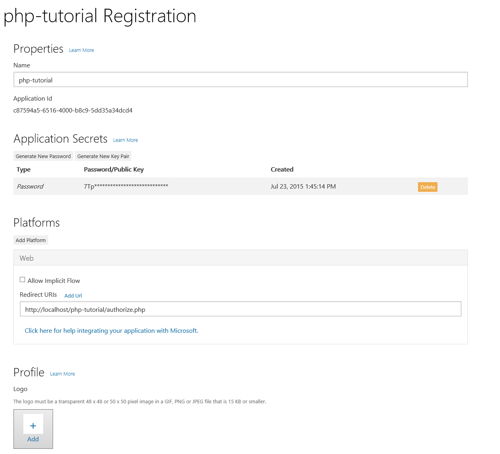

# Getting Started with the Outlook Mail API and PHP #

The purpose of this guide is to walk through the process of creating a simple PHP app that retrieves messages in Office 365 or Outlook.com. The source code in this repository is what you should end up with if you follow the steps outlined here.

> **NOTE:** This branch (`outlook-api`) is a snapshot of the tutorial before it was updated to use the [Microsoft Graph API](https://developer.microsoft.com/en-us/graph/) via the [Microsoft Graph SDK for PHP](https://github.com/microsoftgraph/msgraph-sdk-php). Microsoft recommends using the Microsoft Graph to access Outlook mail, calendar, and contacts. You should use the Outlook APIs directly (via https://outlook.office.com/api) only if you require a feature that is not available on the Graph endpoints. For the Graph version of this tutorial, see the `master` branch.

This tutorial will use [cURL](http://php.net/manual/en/book.curl.php) to send oAuth2 and REST API calls.

## Before you begin ##

This guide assumes:

- That you already have a web server with PHP installed and working, either on your development machine or on a remote server. The tutorial was created using PHP 5.6.0 running on IIS 8.
- That you have an Office 365 tenant, with access to an account in that tenant **OR** an Outlook.com developer preview account.

## Create the app ##

Let's dive right in! On your web server, create a new directory beneath the root directory called `php-tutorial`. For example, if you're using your development machine as your web server, the resulting URL would be `http://localhost/php-tutorial`. Within this directory create a `home.php` file and open it in your code editor of choice. This will be the home page for the app.

## Designing the app ##

Our app will be very simple. When a user visits the site, they will see a link to log in and view their email. Clicking that link will take them to the Azure login page where they can login with their Office 365 or Outlook.com account and grant access to our app. Finally, they will be redirected back to our app, which will display a list of the most recent email in the user's inbox.

Let's begin by replacing the stock home page with a simpler one. Open the `./home.php` file and add the following code.

#### Contents of the `./home.php` file ####

```HTML+PHP
<?php
session_start();
  $loggedIn = false;
?>

<html>
<head>
<title>PHP Mail API Tutorial</title>
</head>
  <body>
  <?php 
      if (!$loggedIn) {
  ?>
  <!-- User not logged in, prompt for login -->
      <p>Please <a href="#">sign in</a> with your Office 365 or Outlook.com account.</p>
  <?php
    }
      else {
  ?>
  <!-- User is logged in, do something here -->
      <p>Hello user!</p>
  <?php
    }
  ?>
  </body>
</html>
```

The link doesn't do anything yet, but we'll fix that soon.

## Implementing OAuth2 ##

Our goal in this section is to make the link on our home page initiate the [OAuth2 Authorization Code Grant flow with Azure AD](https://msdn.microsoft.com/en-us/library/azure/dn645542.aspx). 

Before we proceed, we need to register our app to obtain a client ID and secret. Head over to https://apps.dev.microsoft.com to quickly get a client ID and secret. Using the sign in buttons, sign in with either your Microsoft account (Outlook.com), or your work or school account (Office 365).


Once you're signed in, click the **Add an app** button. Enter `php-tutorial` for the name and click **Create application**. After the app is created, locate the **Application Secrets** section, and click the **Generate New Password** button. Copy the password now and save it to a safe place. Once you've copied the password, click **Ok**.


Locate the **Platforms** section, and click **Add Platform**. Choose **Web**, then enter `http://localhost/php-tutorial/authorize.php` under **Redirect URIs**. Click **Save** to complete the registration. Copy the **Application Id** and save it along with the password you copied earlier. We'll need those values soon.

Here's what the details of your app registration should look like when you are done.



### Back to coding ###

Create a new file to contain all of our OAuth functions called `oauth.php`. In this file we will define a helper class called `oAuthService`. Paste in the following code.

#### Contents of the `./oauth.php` file ####

```PHP
<?php
  class oAuthService {
    private static $clientId = "YOUR APP ID HERE";
    private static $clientSecret = "YOUR APP PASSWORD HERE";
    private static $authority = "https://login.microsoftonline.com";
    private static $authorizeUrl = '/common/oauth2/v2.0/authorize?client_id=%1$s&redirect_uri=%2$s&response_type=code&scope=%3$s';
    private static $tokenUrl = "/common/oauth2/v2.0/token";

  // The app only needs openid (for user's ID info), and Mail.Read
    private static $scopes = array("openid", 
                                   "https://outlook.office.com/mail.read");
    
    public static function getLoginUrl($redirectUri, $scopes) {
      // Build scope string. Multiple scopes are separated
      // by a space
      $scopestr = implode(" ", self::$scopes);
      
      $loginUrl = self::$authority.sprintf(self::$authorizeUrl, self::$clientId, urlencode($redirectUri), urlencode($scopestr));
      
      error_log("Generated login URL: ".$loginUrl);
      return $loginUrl;
    }
  }
?>
```

Paste in the app ID and password you obtained from the App Registration Tool for the values of `$clientId` and `$clientSecret`.

The class exposes one function for now, `getLoginUrl`. This function will generate the URL to the sign in page for the user to initiate the oAuth flow. Now we need to update the home page to call this function to provide a value for the `href` attribute of our sign in link.

#### Updated contents of the `./home.php` file ####

```HTML+PHP
<?php
  session_start();
  require('oauth.php');
  
  $loggedIn = false;
  $redirectUri = 'http://localhost/php-tutorial/authorize.php';
?>

<html>
  <head>
      <title>PHP Mail API Tutorial</title>
  </head>
  <body>
    <?php 
      if (!$loggedIn) {
    ?>
      <!-- User not logged in, prompt for login -->
      <p>Please <a href="<?php echo oAuthService::getLoginUrl($redirectUri)?>">sign in</a> with your Office 365 or Outlook.com account.</p>
    <?php
      }
      else {
    ?>
      <!-- User is logged in, do something here -->
      <p>Hello user!</p>
    <?php    
      }
    ?>
  </body>
</html>
```

Save your work and copy the files to your web server. If you browse to `http://localhost/php-tutorial/home.php` and hover over the sign in link, it should look like this:

	  https://login.microsoftonline.com/common/oauth2/v2.0/authorize?client_id=<SOME GUID>&redirect_uri=https%3A%2F%2Flocalhost%2Fphp-tutorial%2Fauthorize.php&response_type=code&scope=openid+https%3A%2F%2Foutlook.office.com%2Fmail.read

Clicking on the link will allow you to sign in and grant access to the app, but will then result in an error. Notice that your browser gets redirected to `http://localhost/php-tutorial/authorize.php`. That file doesn't exist yet. Don't worry, that's our next task.

Create the `authorize.php` file and add the following code.

#### Contents of the `./authorize.php` file ####

```HTML+PHP
<?php
  session_start();
  $auth_code = $_GET['code'];
?>

<p>Auth code: <?php echo $auth_code ?></p>
```

This doesn't do anything but display the authorization code returned by Azure, but it will let us test that we can successfully log in. Now if you sign in to the app, you should end up with a page that shows the authorization code. Now let's do something with it.

### Exchanging the code for a token ###

Now let's add a new function to the `oAuthService` class to retrieve a token. Add the following function to the class in the `./oauth.php` file.

#### New `getToken` function in `./oauth.php` ####

```PHP
public static function getToken($grantType, $code, $redirectUri) {
  // Build the form data to post to the OAuth2 token endpoint
  $token_request_data = array(
    "grant_type" => $grantType,
    "code" => $code,
    "redirect_uri" => $redirectUri,
    "scope" => implode(" ", self::$scopes),
    "client_id" => self::$clientId,
    "client_secret" => self::$clientSecret
  );
  
  // Calling http_build_query is important to get the data
  // formatted as expected.
  $token_request_body = http_build_query($token_request_data);
  error_log("Request body: ".$token_request_body);
  
  $curl = curl_init(self::$authority.self::$tokenUrl);
  curl_setopt($curl, CURLOPT_RETURNTRANSFER, true);
  curl_setopt($curl, CURLOPT_POST, true);
  curl_setopt($curl, CURLOPT_POSTFIELDS, $token_request_body);
  
  $response = curl_exec($curl);
  error_log("curl_exec done.");
  
  $httpCode = curl_getinfo($curl, CURLINFO_HTTP_CODE);
  error_log("Request returned status ".$httpCode);
  if ($httpCode >= 400) {
    return array('errorNumber' => $httpCode,
                 'error' => 'Token request returned HTTP error '.$httpCode);
  }
  
  // Check error
  $curl_errno = curl_errno($curl);
  $curl_err = curl_error($curl);
  if ($curl_errno) {
    $msg = $curl_errno.": ".$curl_err;
    error_log("CURL returned an error: ".$msg);
    return array('errorNumber' => $curl_errno,
                  'error' => $msg);
  }
  
  curl_close($curl);
  
  // The response is a JSON payload, so decode it into
  // an array.
  $json_vals = json_decode($response, true);
  error_log("TOKEN RESPONSE:");
  foreach ($json_vals as $key=>$value) {
    error_log("  ".$key.": ".$value);
  }
  
  return $json_vals;
}
```

This function uses cURL to issue the access token request to login.microsoftonline.com. The first part of this function is building the payload of the request, then the rest is using cURL to issue a POST request to the OAuth2 token endpoint. Finally, the results are parsed into an array of values using `json_decode`.

Now add a wrapper function to pass the correct grant type in the `$grantType` parameter for exchanging an authorization code for a token.

#### New `getTokenFromAuthCode` function in `./oauth.php` ####

```PHP
public static function getTokenFromAuthCode($authCode, $redirectUri) {
  return self::getToken("authorization_code", $authCode, $redirectUri);
}
```

Structuring the code this way will allow us to reuse the `getToken` function later. Let's see if this works. Replace the contents of the `./authorize.php` file with the following.

#### Updated contents of `./authorize.php` ####

```HTML+PHP
<?php
  session_start();
  require_once('oauth.php');
  $auth_code = $_GET['code'];
  $redirectUri = 'http://localhost/php-tutorial/authorize.php';
  
  $tokens = oAuthService::getTokenFromAuthCode($auth_code, $redirectUri);
?>

<p>Access Token: <?php echo $tokens['access_token'] ?></p>
```

Save your changes and restart the app. This time, after you sign in, you should see an access token displayed.

### Getting the user's email address ###

Our first use of the access token will be to get the user's email address from the Outlook API. You'll see why we want this soon.

Let's start by adding a new file to contain all of our Outlook API functions called `outlook.php`. We'll start by creating a generic function `makeApiCall` that can be used to send REST requests. Paste in the following code.

#### Contents of `./outlook.php` ####

```PHP
<?php
  class OutlookService {
    private static $outlookApiUrl = "https://outlook.office.com/api/v2.0";

    public static function makeApiCall($access_token, $user_email, $method, $url, $payload = NULL) {
      // Generate the list of headers to always send.
      $headers = array(
        "User-Agent: php-tutorial/1.0",         // Sending a User-Agent header is a best practice.
        "Authorization: Bearer ".$access_token, // Always need our auth token!
        "Accept: application/json",             // Always accept JSON response.
        "client-request-id: ".self::makeGuid(), // Stamp each new request with a new GUID.
        "return-client-request-id: true",       // Tell the server to include our request-id GUID in the response.
        "X-AnchorMailbox: ".$user_email         // Provider user's email to optimize routing of API call
      );
      
      $curl = curl_init($url);
      
      switch(strtoupper($method)) {
        case "GET":
          // Nothing to do, GET is the default and needs no
          // extra headers.
          error_log("Doing GET");
          break;
        case "POST":
          error_log("Doing POST");
          // Add a Content-Type header (IMPORTANT!)
          $headers[] = "Content-Type: application/json";
          curl_setopt($curl, CURLOPT_POST, true);
          curl_setopt($curl, CURLOPT_POSTFIELDS, $payload);
          break;
        case "PATCH":
          error_log("Doing PATCH");
          // Add a Content-Type header (IMPORTANT!)
          $headers[] = "Content-Type: application/json";
          curl_setopt($curl, CURLOPT_CUSTOMREQUEST, "PATCH");
          curl_setopt($curl, CURLOPT_POSTFIELDS, $payload);
          break;
        case "DELETE":
          error_log("Doing DELETE");
          curl_setopt($curl, CURLOPT_CUSTOMREQUEST, "DELETE");
          break;
        default:
          error_log("INVALID METHOD: ".$method);
          exit;
      }
      
      curl_setopt($curl, CURLOPT_RETURNTRANSFER, true);
      curl_setopt($curl, CURLOPT_HTTPHEADER, $headers);
      $response = curl_exec($curl);
      error_log("curl_exec done.");
      
      $httpCode = curl_getinfo($curl, CURLINFO_HTTP_CODE);
      error_log("Request returned status ".$httpCode);
      
      if ($httpCode >= 400) {
        return array('errorNumber' => $httpCode,
                     'error' => 'Request returned HTTP error '.$httpCode);
      }
      
      $curl_errno = curl_errno($curl);
      $curl_err = curl_error($curl);
      
      if ($curl_errno) {
        $msg = $curl_errno.": ".$curl_err;
        error_log("CURL returned an error: ".$msg);
        curl_close($curl);
        return array('errorNumber' => $curl_errno,
                     'error' => $msg);
      }
      else {
        error_log("Response: ".$response);
        curl_close($curl);
        return json_decode($response, true);
      }
    }
    
    // This function generates a random GUID.
    public static function makeGuid(){
        if (function_exists('com_create_guid')) {
          error_log("Using 'com_create_guid'.");
          return strtolower(trim(com_create_guid(), '{}'));
        }
        else {
          error_log("Using custom GUID code.");
          $charid = strtolower(md5(uniqid(rand(), true)));
          $hyphen = chr(45);
          $uuid = substr($charid, 0, 8).$hyphen
                  .substr($charid, 8, 4).$hyphen
                  .substr($charid, 12, 4).$hyphen
                  .substr($charid, 16, 4).$hyphen
                  .substr($charid, 20, 12);
                
          return $uuid;
        }
    }
  }
?>
```

This function uses cURL to send the appropriate request to the specified endpoint, using the access token for authentication. It also uses the user's email address for an important optimization. By setting the `X-AnchorMailbox` header to the user's email address, the API endpoint can route API calls to the correct backend mailbox servers more efficiently. This is why we want to get the user's email address.

Now let's create a function to make us of the `makeApiCall` function to get the user's email address. Add a function called `getUser` to `outlook.php`.

#### New `getUser` function in `./outlook.php` ####

```PHP
public static function getUser($access_token) {
  $getUserParameters = array (
    // Only return the user's display name and email address
    "\$select" => "DisplayName,EmailAddress"
  );

  $getUserUrl = self::$outlookApiUrl."/Me?".http_build_query($getUserParameters);

  return self::makeApiCall($access_token, "", "GET", $getUserUrl);
}
```

Now let's update `./authorize.php` one more time to get the user's email address, save the access token and email address into session variables, and redirect back to the home page.

#### Updated contents of `./authorize.php` ####

```PHP
<?php
  session_start();
  require_once('oauth.php');
  require_once('outlook.php');
  $auth_code = $_GET['code'];
  $redirectUri = 'http://localhost/php-tutorial/authorize.php';
  
  $tokens = oAuthService::getTokenFromAuthCode($auth_code, $redirectUri);
  
  if ($tokens['access_token']) {
    $_SESSION['access_token'] = $tokens['access_token'];

    // Get the user's email
    $user = OutlookService::getUser($tokens['access_token']);
    $_SESSION['user_email'] = $user['EmailAddress'];
      
    // Redirect back to home page
    header("Location: http://localhost/php-tutorial/home.php");
  }
  else
  {
    echo "<p>ERROR: ".$tokens['error']."</p>";
  }
?>
```

Finally, let's update the `./home.php` file to check for the presence of the access token in the session and display it instead of the login link if present.

#### Updated contents of `./home.php` ####

```HTML+PHP
<?php
  session_start();
  require('oauth.php');
  
  $loggedIn = !is_null($_SESSION['access_token']);
    $redirectUri = 'http://localhost/php-tutorial/authorize.php';
?>

<html>
  <head>
    <title>PHP Mail API Tutorial</title>
  </head>
  <body>
    <?php 
      if (!$loggedIn) {
    ?>
      <!-- User not logged in, prompt for login -->
      <p>Please <a href="<?php echo oAuthService::getLoginUrl($redirectUri)?>">sign in</a> with your Office 365 or Outlook.com account.</p>
    <?php
      }
      else {
    ?>
      <!-- User is logged in, do something here -->
      <p>Access token: <?php echo $_SESSION['access_token'] ?></p>
    <?php    
      }
    ?>
  </body>
</html>
```

### Refreshing the access token

Access tokens returned from Azure are valid for an hour. If you use the token after it has expired, the API calls will return 401 errors. You could ask the user to sign in again, but the better option is to refresh the token silently.

In order to do that, the app must request the `offline_access` scope. Add this scope to the `$scopes` array in `oauth.php`:

```PHP
// The scopes the app requires
private static $scopes = array("openid",
                               "offline_access",
                               "https://outlook.office.com/mail.read");
```

This will cause the token response from Azure to include a refresh token. Let's update `authorize.php` to save the refresh token and the expiration time in a session cookie.

#### Updated contents of `./authorize.php` ####

```PHP
<?php
  session_start();
  require_once('oauth.php');
  require_once('outlook.php');
  $auth_code = $_GET['code'];
  $redirectUri = 'http://localhost/php-tutorial/authorize.php';
  
  $tokens = oAuthService::getTokenFromAuthCode($auth_code, $redirectUri);
  
  if ($tokens['access_token']) {
    $_SESSION['access_token'] = $tokens['access_token'];
    $_SESSION['refresh_token'] = $tokens['refresh_token'];

    // expires_in is in seconds
    // Get current timestamp (seconds since Unix Epoch) and
    // add expires_in to get expiration time
    // Subtract 5 minutes to allow for clock differences
    $expiration = time() + $tokens['expires_in'] - 300;
    $_SESSION['token_expires'] = $expiration;
    
    // Get the user's email
    $user = OutlookService::getUser($tokens['access_token']);
    $_SESSION['user_email'] = $user['EmailAddress'];
    
    // Redirect back to home page
    header("Location: http://localhost/php-tutorial/home.php");
  }
  else
  {
    echo "<p>ERROR: ".$tokens['error']."</p>";
  }
?>
```

Then let's add a function to call the `getToken` function to refresh our tokens.

#### New `getTokenFromRefreshToken` function in `./oauth.php` ####

```PHP
public static function getTokenFromRefreshToken($refreshToken, $redirectUri) {
  return self::getToken("refresh_token", $refreshToken, $redirectUri);
}
```

Now let's add a helper function to automatically refresh the token if needed. Add the following function to `oauth.php`.

#### New `getAccessToken` function in `./oauth.php` ####

```PHP
public static function getAccessToken($redirectUri) {
  // Is there an access token in the session?
  $current_token = $_SESSION['access_token'];
  if (!is_null($current_token)) {
    // Check expiration
    $expiration = $_SESSION['token_expires'];
    if ($expiration < time()) {
      error_log('Token expired! Refreshing...');
      // Token expired, refresh
      $refresh_token = $_SESSION['refresh_token'];
      $new_tokens = self::getTokenFromRefreshToken($refresh_token, $redirectUri);

      // Update the stored tokens and expiration
      $_SESSION['access_token'] = $new_tokens['access_token'];
      $_SESSION['refresh_token'] = $new_tokens['refresh_token'];

      // expires_in is in seconds
      // Get current timestamp (seconds since Unix Epoch) and
      // add expires_in to get expiration time
      // Subtract 5 minutes to allow for clock differences
      $expiration = time() + $new_tokens['expires_in'] - 300;
      $_SESSION['token_expires'] = $expiration;

      // Return new token
      return $new_tokens['access_token'];
    }
    else {
      // Token is still valid, return it
      return $current_token;
    }
  } 
  else {
    return null;
  }
}
```

This method checks the expiration time. If the current time is greater than the expiration, it calls our `getTokenFromRefreshToken` function to refresh. Otherwise, it just returns the cached token.

Now that we have an access token and we can refresh if needed, we're ready to use the Mail API.

## Using the Mail API ##

We can use the `makeApiCall` function to call any of Outlook REST APIs. Let's add a new function to the `OutlookService` class to get the user's 10 most recent messages from the inbox.

In order to call the `makeApiCall` function, we need an access token, the user's email address, a method, a URL, and an optional payload. We already have the access token, and from the [Mail API Reference](https://msdn.microsoft.com/office/office365/APi/mail-rest-operations#GetMessages), we know that the method to get messages is `GET` and that the URL to get messages from the inbox is `https://outlook.office.com/api/v2.0/me/mailfolders/inbox/messages`. Using that information, add a `getMessages` function in `outlook.php`.

#### New `getMessages` function in `./outlook.php` ####

```PHP
public static function getMessages($access_token, $user_email) {
  $getMessagesParameters = array (
    // Only return Subject, ReceivedDateTime, and From fields
    "\$select" => "Subject,ReceivedDateTime,From",
    // Sort by ReceivedDateTime, newest first
    "\$orderby" => "ReceivedDateTime DESC",
    // Return at most 10 results
    "\$top" => "10"
  );
  
  $getMessagesUrl = self::$outlookApiUrl."/Me/MailFolders/Inbox/Messages?".http_build_query($getMessagesParameters);
                    
  return self::makeApiCall($access_token, $user_email, "GET", $getMessagesUrl);
}
```

The function uses OData query parameters to do the following.

- Request that only the `Subject`, `ReceivedDateTime`, and `From` fields for each message be returned. It's always a good idea to limit your result set to only those fields that you will use in your app.
- Sort the results by date and time each message was received.
- Limit the results to the first 10 items.

Update `./home.php` to call the `getMessages` function and display the results.

#### Updated contents of `./home.php` ####

```HTML+PHP
<?php
  session_start();
  require('oauth.php');
  require('outlook.php');
  
  $loggedIn = !is_null($_SESSION['access_token']);
    $redirectUri = 'http://localhost/php-tutorial/authorize.php';
?>

<html>
  <head>
    <title>PHP Mail API Tutorial</title>
  </head>
  <body>
    <?php 
      if (!$loggedIn) {
    ?>
      <!-- User not logged in, prompt for login -->
      <p>Please <a href="<?php echo oAuthService::getLoginUrl($redirectUri)?>">sign in</a> with your Office 365 or Outlook.com account.</p>
    <?php
      }
      else {
        $messages = OutlookService::getMessages(oAuthService::getAccessToken($redirectUri), $_SESSION['user_email']);
    ?>
      <!-- User is logged in, do something here -->
      <p>Messages: <?php echo print_r($messages) ?></p>
    <?php    
      }
    ?>
  </body>
</html>
```

If you restart the app now, you should get a very rough listing of the results array. Let's add a little HTML and PHP to display the results in a nicer way.

### Displaying the results ###

We'll add a basic HTML table to our home page, with columns for the subject, date and time received, and sender. We can then iterate over the results array and add rows to the table.

Update `./home.php` one final time to generate the table.

#### Updated contents of `./home.php` ####

```HTML+PHP
<?php
  session_start();
  require('oauth.php');
  require('outlook.php');
  
  $loggedIn = !is_null($_SESSION['access_token']);
    $redirectUri = 'http://localhost/php-tutorial/authorize.php';
?>

<html>
  <head>
  <title>PHP Mail API Tutorial</title>
  </head>
  <body>
    <?php 
      if (!$loggedIn) {
    ?>
      <!-- User not logged in, prompt for login -->
      <p>Please <a href="<?php echo oAuthService::getLoginUrl($redirectUri)?>">sign in</a> with your Office 365 or Outlook.com account.</p>
    <?php
      }
      else {
        $messages = OutlookService::getMessages(oAuthService::getAccessToken($redirectUri), $_SESSION['user_email']);
    ?>
      <!-- User is logged in, do something here -->
      <h2>Your messages</h2>
      
      <table>
        <tr>
          <th>From</th>
          <th>Subject</th>
          <th>Received</th>
        </tr>
        
        <?php foreach($messages['value'] as $message) { ?>
          <tr>
            <td><?php echo $message['From']['EmailAddress']['Name'] ?></td>
            <td><?php echo $message['Subject'] ?></td>
            <td><?php echo $message['ReceivedDateTime'] ?></td>
          </tr>
        <?php } ?>
      </table>
    <?php    
      }
    ?>
  </body>
</html>
```

Save your changes and run the app. You should now get a list of messages that looks something like this.


## Next Steps ##

Now that you've created a working sample, you may want to learn more about the [capabilities of the Mail API](https://msdn.microsoft.com/office/office365/APi/mail-rest-operations). If your sample isn't working, and you want to compare, you can download the end result of this tutorial from [GitHub](https://github.com/jasonjoh/php-tutorial).

## Copyright ##

Copyright (c) Microsoft. All rights reserved.

----------
Connect with me on Twitter [@JasonJohMSFT](https://twitter.com/JasonJohMSFT)

Follow the [Exchange Dev Blog](http://blogs.msdn.com/b/exchangedev/)
